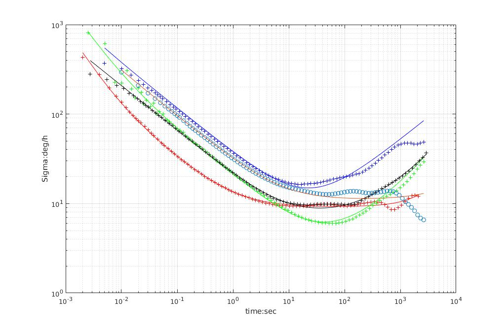
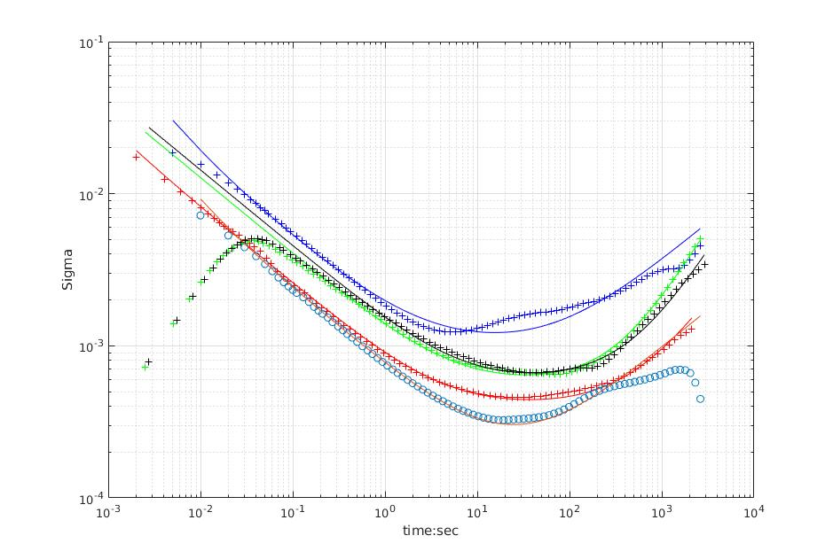

# imu_utils

A ROS package tool to analyze the IMU performance. C++ version of Allan Variance Tool. 
The figures are drawn by Matlab, in `scripts`.

Actually, just analyze the Allan Variance for the IMU data. Collect the data while the IMU is Stationary, with a two hours duration.

## refrence

Refrence technical report: [`Allan Variance: Noise Analysis for Gyroscopes`](http://cache.freescale.com/files/sensors/doc/app_note/AN5087.pdf "Allan Variance: Noise Analysis for Gyroscopes"), [`vectornav gyroscope`](https://www.vectornav.com/support/library/gyroscope "vectornav gyroscope") and 
[`An introduction to inertial navigation`](http://www.cl.cam.ac.uk/techreports/UCAM-CL-TR-696.html "An introduction to inertial navigation").

```
Woodman, O.J., 2007. An introduction to inertial navigation (No. UCAM-CL-TR-696). University of Cambridge, Computer Laboratory.
```
Refrence Matlab code: [`GyroAllan`](https://github.com/XinLiGitHub/GyroAllan "GyroAllan")

## IMU Noise Values

Parameter | YAML element | Symbol | Units
--- | --- | --- | ---
Gyroscope "white noise" | `gyr_n` |  | 
Accelerometer "white noise" | `acc_n` |  | 
Gyroscope "random walk" | `gyr_w` |  | 
Accelerometer "random walk" | `acc_w` |  | 

## sample test




* blue  : Vi-Sensor, ADIS16448, `200Hz`
* red   : 3dm-Gx4, `500Hz`
* green : DJI-A3, `400Hz`
* black : DJI-N3, `400Hz`
* circle : xsens-MTI-100, `100Hz`

## How to build and run?

### to build

```
sudo apt-get install libdw-dev
```

* download required [`code_utils`](https://github.com/gaowenliang/code_utils "code_utils");

* put the ROS package `imu_utils` and `code_utils` into your workspace, usually named `catkin_ws`;

* cd to your workspace, build with `catkin_make`;


### to run

* collect the data while the IMU is Stationary, with a two hours duration;

* (or) play rosbag dataset;

```
 rosbag play -r 200 imu_A3.bag
```

* roslaunch the rosnode;

```
roslaunch imu_utils A3.launch
```

Be careful of your roslaunch file:

```
<launch>
    <node pkg="imu_utils" type="imu_an" name="imu_an" output="screen">
        <param name="imu_topic" type="string" value= "/djiros/imu"/>
        <param name="imu_name" type="string" value= "A3"/>
        <param name="data_save_path" type="string" value= "$(find imu_utils)/data/"/>
        <param name="max_time_min" type="int" value= "120"/>
        <param name="max_cluster" type="int" value= "100"/>
    </node>
</launch>
```

### sample output:

```yaml
%YAML:1.0
---
type: IMU
name: adis16460
Gyr:
   unit: "gyr_n: rad / sqrt(s), gyr_w: rad / s^2 / sqrt(Hz)"
   avg-axis:
      gyr_n: 1.1473375721490844e-04
      gyr_w: 1.5583335065314776e-06
   x-axis:
      gyr_n: 9.7441149413590147e-05
      gyr_w: 1.6812955184739462e-06
   y-axis:
      gyr_n: 1.2377414778044462e-04
      gyr_w: 1.6469643303041484e-06
   z-axis:
      gyr_n: 1.2298597445069054e-04
      gyr_w: 1.3467406708163381e-06
Acc:
   unit: "acc_n: m / s^2 / sqrt(Hz), acc_w: m / s^3 / sqrt(Hz)"
   avg-axis:
      acc_n: 3.5944406622474847e-03
      acc_w: 2.4347226734583625e-05
   x-axis:
      acc_n: 3.8803125894021403e-03
      acc_w: 2.2829936948447254e-06
   y-axis:
      acc_n: 3.5091717879490694e-03
      acc_w: 2.8121838488310455e-05
   z-axis:
      acc_n: 3.3938376093912452e-03
      acc_w: 4.2636848020595697e-05
```

## dataset

DJI A3: `400Hz`

Download link: [`百度网盘`](https://pan.baidu.com/s/1jJYg8R0 "DJI A3")


DJI A3: `400Hz`

Download link: [`百度网盘`](https://pan.baidu.com/s/1pLXGqx1 "DJI N3")


ADIS16448: `200Hz`
 
Download link:[`百度网盘`](https://pan.baidu.com/s/1dGd0mn3 "ADIS16448")

3dM-GX4: `500Hz`

Download link:[`百度网盘`](https://pan.baidu.com/s/1ggcan9D "GX4")

xsens-MTI-100: `100Hz`

Download link:[`百度网盘`](https://pan.baidu.com/s/1i64xkgP "MTI-100")
